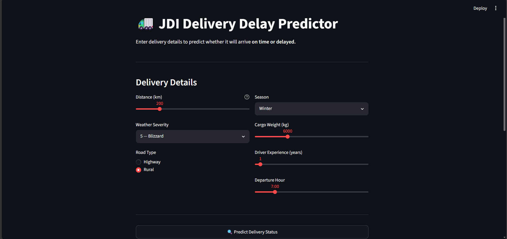
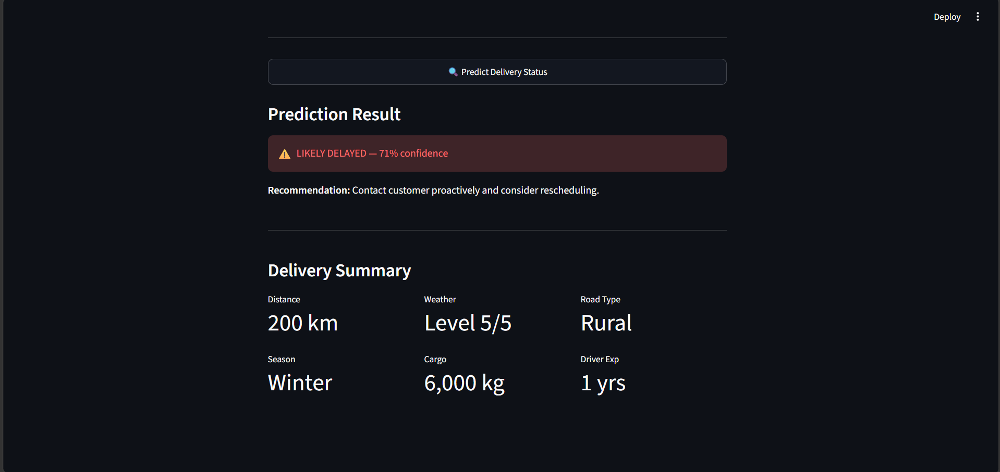
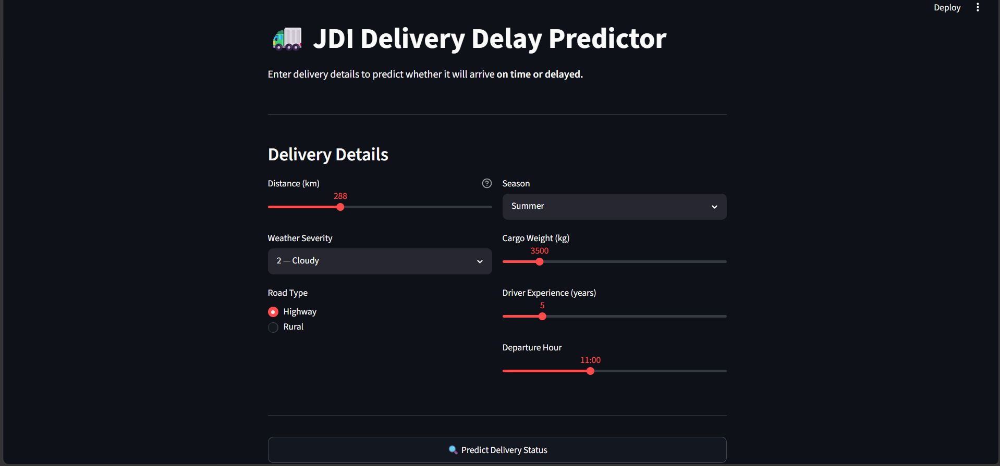
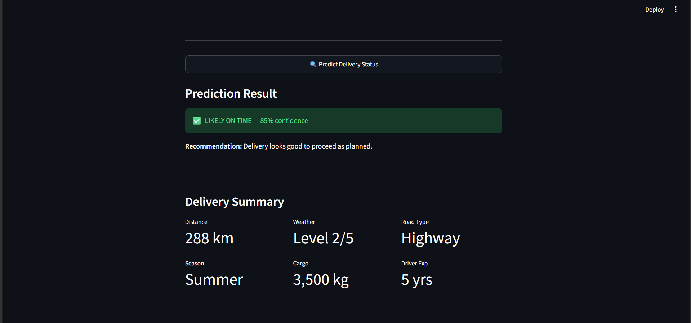

# 🚛 JDI Delivery Delay Predictor

A machine learning system that predicts whether a JD Irving truck delivery
will arrive **on time or delayed** before it departs — enabling dispatchers
to proactively reschedule high-risk deliveries and notify customers in advance.

---

## 📸 Demo

### Delayed Predictions




### On Time Predictions




---

## 🎯 Business Problem

JD Irving operates one of Atlantic Canada's largest trucking networks through
Midland Transport and Sunbury Transport, moving thousands of shipments daily
across New Brunswick, Nova Scotia, and beyond.

Currently, dispatchers have no early warning system — they find out about
delays only when drivers call in, by which point customers are already waiting.

This tool flags at-risk deliveries **before the truck leaves the depot**, giving
dispatchers time to act.

---

## 🏗️ Architecture

```
Streamlit Frontend
       ↓
Spring Boot REST API (Java, port 8080)
       ↓
Flask ML API (Python, port 5000)
       ↓
Logistic Regression Model (scikit-learn)
```

---

## 📊 Dataset

- 2,000 synthetic deliveries generated with realistic delay logic
- 36.3% delay rate — consistent with real trucking data
- Features: distance, weather severity, road type, season,
  cargo weight, driver experience, departure hour

**Key patterns found in EDA:**

- Winter delay rate: 51.2% vs Spring: 29.4%
- Rural road delay rate: 46.2% vs Highway: 29.9%
- Delayed deliveries average weather severity: 3.51 vs 2.76 for on-time

---

## 🤖 ML Pipeline

### Feature Engineering

| Step              | What Was Done                              |
| ----------------- | ------------------------------------------ |
| Label Encoding    | road_type → 0 (highway) / 1 (rural)        |
| One Hot Encoding  | season → 4 binary columns                  |
| MinMaxScaler      | distance, cargo, experience, hour → 0 to 1 |
| Median Imputation | Missing values filled with column median   |

### Model Comparison

| Model               | CV AUC-ROC    | Accuracy | Delayed Recall |
| ------------------- | ------------- | -------- | -------------- |
| Logistic Regression | 0.726 ± 0.023 | 67%      | 40%            |
| SVM (RBF kernel)    | 0.724 ± 0.022 | 68%      | 34%            |

**Selected Model:** Logistic Regression

- Higher recall on delayed class (40% vs 34%)
- More interpretable coefficients
- Nearly identical AUC to SVM

### Evaluation

- 5-fold cross validation
- Confusion matrix, ROC curve, precision-recall curve
- Feature importance via logistic regression coefficients

---

## 🛠️ Tech Stack

| Layer           | Technology           |
| --------------- | -------------------- |
| ML Model        | Python, scikit-learn |
| Data Processing | pandas, numpy        |
| Visualisation   | matplotlib, seaborn  |
| Model API       | Flask (Python)       |
| Backend REST    | Spring Boot (Java)   |
| Frontend        | Streamlit            |
| Version Control | Git, GitHub          |

---

## 📁 Project Structure

```
jdi-delivery-delay-predictor/
├── data/
│   ├── raw/                         ← generated synthetic dataset
│   └── processed/                   ← cleaned and encoded dataset
├── notebooks/
│   ├── 01_data_generation.ipynb     ← dataset creation
│   ├── 02_eda.ipynb                 ← exploratory data analysis
│   ├── 03_feature_engineering.ipynb ← encoding, scaling, imputation
│   ├── 04_model_training.ipynb      ← LR vs SVM training + comparison
│   └── 05_model_evaluation.ipynb    ← feature importance, PR curve
├── models/
│   └── best_model.pkl               ← saved logistic regression model
├── app/
│   ├── flask_api.py                 ← ML model served as REST API
│   └── streamlit_app.py             ← interactive web interface
├── springboot/                      ← Java Spring Boot REST layer
├── charts/                          ← EDA and evaluation charts
├── screenshots/                     ← app demo screenshots
└── README.md
```

---

## 🚀 How To Run

### Prerequisites

- Python 3.10+
- Java 24
- Maven (bundled with project)

### Install Python Dependencies

```bash
pip install -r requirements.txt
```

### Step 1 — Start Flask API

```bash
python app/flask_api.py
```

Flask runs on http://localhost:5000

### Step 2 — Start Spring Boot (optional)

```bash
cd springboot
.\mvnw.cmd spring-boot:run -DskipTests
```

Spring Boot runs on http://localhost:8080

### Step 3 — Start Streamlit App

```bash
streamlit run app/streamlit_app.py
```

App opens at http://localhost:8501

---

## 💡 Business Impact

| Problem                         | Solution                                 |
| ------------------------------- | ---------------------------------------- |
| No early warning for delays     | Model flags risk before departure        |
| Reactive customer communication | Proactive calls for high-risk deliveries |
| Gut-feel dispatch decisions     | Data-driven risk scoring                 |
| Atlantic Canada winter risk     | Weather severity is top delay predictor  |

> Out of every 100 delayed deliveries, this model identifies
> 40 before the truck leaves the depot.

---

## 📈 Future Improvements

- Integrate real GPS and historical delivery data for higher AUC
- Add driver fatigue scoring as a feature
- Build a daily risk report dashboard for dispatch managers
- Deploy to Streamlit Cloud for permanent access

---

## 👤 Author

Built as a co-op portfolio project demonstrating ML engineering
skills relevant to JD Irving Limited's transportation operations.

---

## ⚠️ Disclaimer

This project uses synthetic data generated to simulate JDI's
trucking operations. It is not affiliated with or endorsed by
JD Irving Limited. All data was artificially generated for
educational and portfolio purposes.
